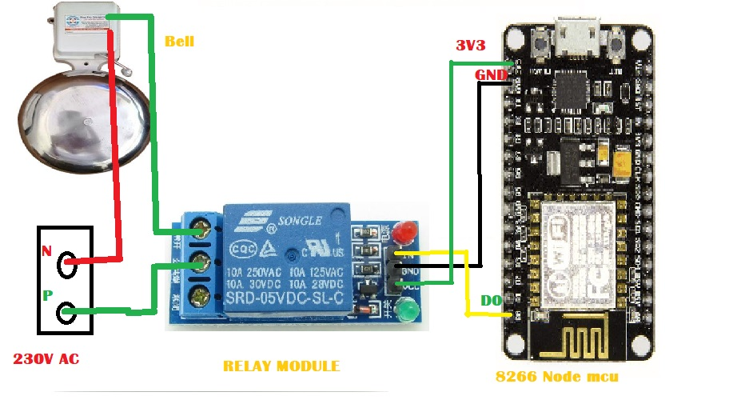

# Automatic College Bell

This project implements an automatic bell system using an ESP8266 microcontroller. The system connects to a WiFi network, synchronizes with an NTP server to get the current time, and controls an LED to simulate a bell ringing at specified times.

## Hardware Requirements

- ESP8266 (e.g., NodeMCU)
- LED (or a relay connected to a bell)
- Resistor (appropriate value for the LED)
- Breadboard and jumper wires

## Software Requirements

- Arduino IDE with ESP8266 board support
- Required libraries:
  - `ESP8266WiFi`
  - `NTPClient`
  - `WiFiUdp`

## Installation

1. **Install Arduino IDE**:
   Download and install the Arduino IDE from [here](https://www.arduino.cc/en/Main/Software).

2. **Add ESP8266 Board to Arduino IDE**:
   Open Arduino IDE and navigate to `File > Preferences`. In the `Additional Board Manager URLs` field, add the following URL:http://arduino.esp8266.com/stable/package_esp8266com_index.json
   
Then, go to `Tools > Board > Boards Manager`, search for `esp8266` and install `esp8266` platform.

3. **Install Required Libraries**:
Go to `Sketch > Include Library > Manage Libraries`, search for and install the following libraries:
- `ESP8266WiFi`
- `NTPClient`
- `WiFiUdp`

4. **Upload Code to ESP8266**:
- Open the Arduino IDE.
- Copy and paste the provided code into the editor.
- Update `ssid` and `password` with your WiFi credentials.
- Select the appropriate board and port under `Tools`.
- Click the Upload button.

## Connection Diagram

## Code Explanation

The code performs the following functions:

1. **Connect to WiFi**:
Connects the ESP8266 to the specified WiFi network.

2. **Sync Time with NTP Server**:
Uses the `NTPClient` library to get the current time from an NTP server and adjust for the specified UTC offset.

3. **HTTP Server**:
Sets up an HTTP server to handle requests to manually turn the bell (LED) on or off.

4. **Bell Schedule**:
Automatically turns the bell (LED) on and off at specified times during the week.

## Usage

1. **Power the ESP8266**:
Connect the ESP8266 to a power source.

2. **Monitor Serial Output**:
Open the Serial Monitor in the Arduino IDE (set baud rate to 115200) to view connection status and debug messages.

3. **Access the Web Interface**:
Once connected to WiFi, the IP address will be printed in the Serial Monitor. Open this IP address in a web browser to manually control the bell.

4. **Bell Schedule**:
The bell (LED) will automatically turn on and off based on the predefined schedule in the code. The schedule is different for Fridays and other weekdays.

## Customization

- **WiFi Credentials**:
Update the `ssid` and `password` variables with your WiFi network name and password.

- **Bell Times**:
Modify the bell ringing times by changing the conditions in the `loop` function.

- **LED Pin**:
Change the `LED` variable to the appropriate GPIO pin connected to your LED or relay.

## Troubleshooting

- **Connection Issues**:
Ensure that the WiFi credentials are correct and that the ESP8266 is within range of the WiFi network.

- **Time Sync Issues**:
Verify that the NTP server (`pool.ntp.org`) is reachable from your network.

- **LED Not Working**:
Check the wiring and ensure the LED is properly connected to the specified GPIO pin with an appropriate resistor.

## License

This project is open-source and available under the GNU GLP V3. Feel free to modify and distribute.

## Acknowledgments

Special thanks to the creators of the `ESP8266WiFi`, `NTPClient`, and `WiFiUdp` libraries for making this project possible.
   
